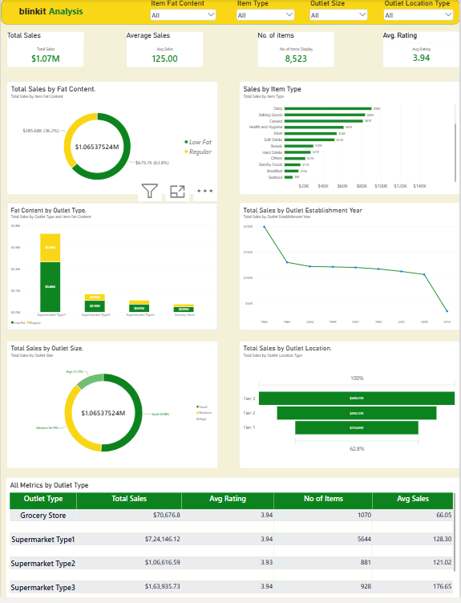

# Blinkit Sales Analysis | Excel + MySQL + Power BI

## Project Overview
An end-to-end data analytics project that analyses Blinkit's sales performance, customer ratings and outlet distribution. Raw data is cleaned in Excel, queried in MySQL, and visualised in an interactive Power BI dashboard.

> **Note:** The dataset used here is synthetic (generated for practice) and is not actual Blinkit company data.

## Business Requirement
Analyse sales performance, customer satisfaction and inventory distribution to identify key insights and optimisation opportunities using KPIs and visualisations.

## Tools Used
- **Excel**: data walkthrough, cleaning, pivot table validation
- **MySQL**: database setup, KPI and chart queries
- **Power BI**: data modelling, DAX measures, dashboard

## Dataset
8,523 rows and 12 columns: Item Fat Content, Item Identifier, Item Type, Outlet Establishment Year, Outlet Identifier, Outlet Location Type, Outlet Size, Outlet Type, Item Visibility, Item Weight, Sales, Rating.

## Project Workflow
1. Requirement gathering
2. Data walkthrough
3. Data cleaning in Excel (standardised `LF`, `low fat` to `Low Fat` and `reg` to `Regular`; removed duplicates)
4. Loaded data into MySQL and wrote KPI and chart queries
5. Cross-checked totals across Excel, SQL and Power BI (Total Sales = 1,065,375)
6. Created DAX measures
7. Built the dashboard with slicers
8. Generated insights

## KPIs
| KPI | Description |
|---|---|
| Total Sales | Overall revenue from all items sold |
| Average Sales | Average revenue per sale |
| No. of Items | Total count of items sold |
| Average Rating | Average customer rating |

## Visuals
1. Total Sales by Fat Content (Donut)
2. Total Sales by Item Type (Bar)
3. Fat Content by Outlet Type (Stacked Column)
4. Total Sales by Outlet Establishment Year (Line)
5. Total Sales by Outlet Size (Donut)
6. Total Sales by Outlet Location (Funnel)
7. All Metrics by Outlet Type (Matrix)

## DAX Measures
```DAX
Total Sales = SUM(blinkit_clean[Sales])
Avg Sales   = AVERAGE(blinkit_clean[Sales])
No of Items = COUNT(blinkit_clean[Item Identifier])
Avg Rating  = AVERAGE(blinkit_clean[Rating])
```

## Dashboard Preview


## Key Insights
- Low Fat items contribute about 64% of total sales.
- Snack Foods and Fruits and Vegetables are the top two categories.
- Supermarket Type1 generates the highest total sales.
- Supermarket Type3 has the highest average sale per item.
- Tier 3 locations contribute the most sales, Tier 1 the least.
- Average rating stays around 3.9 across outlet types.

## Folder Structure
```
Blinkit_Project
 ├── 01_Raw_Data
 ├── 02_Clean_Data
 ├── 03_SQL
 └── 04_PowerBI
```

## Author
Pravesh Kumar Tiwari
LinkedIn: https://www.linkedin.com/in/pravesh-tiwari-6a262b30b/
